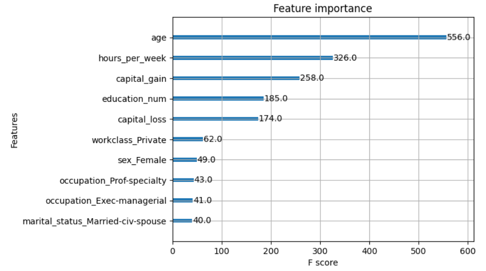
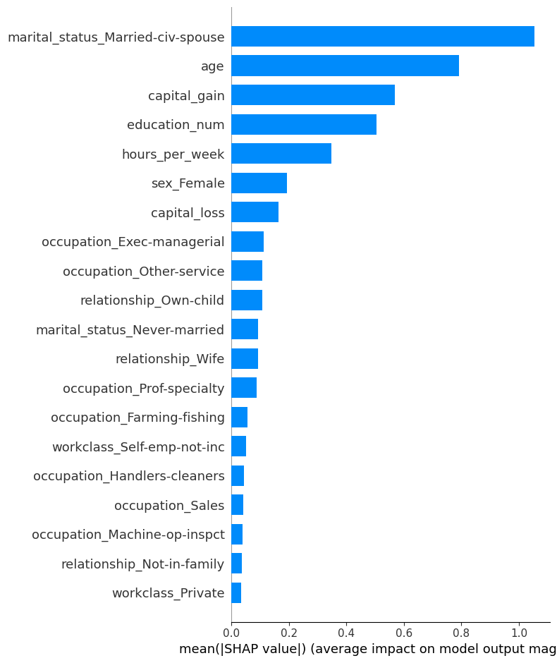
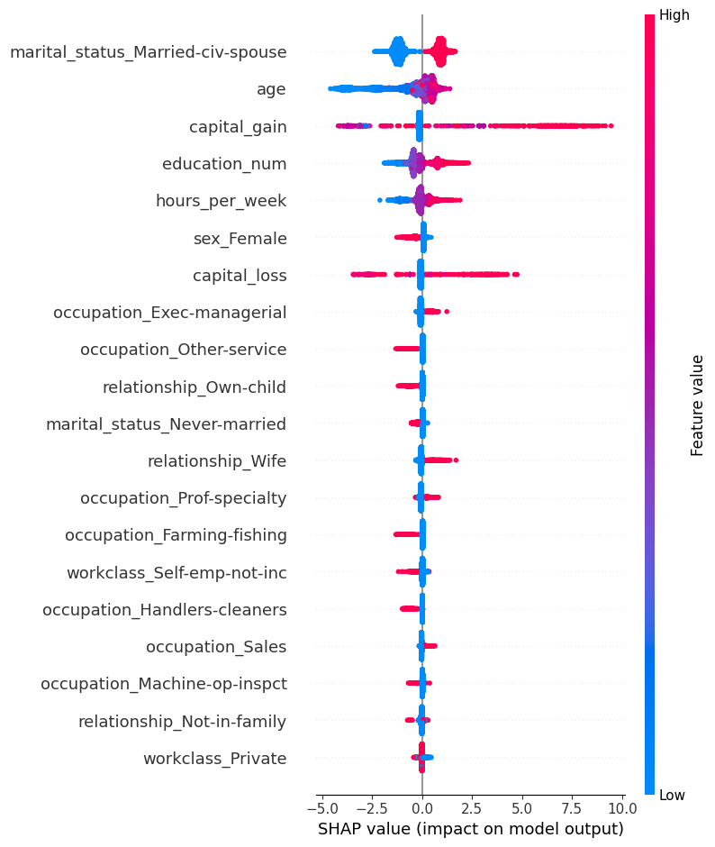
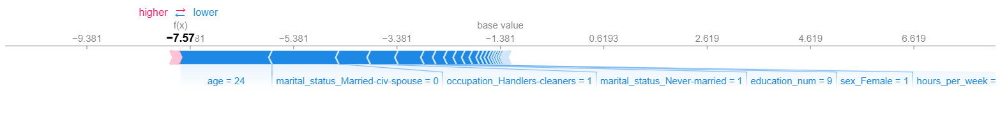

# Individual Income Classifier (XGBoost)

A personal project to classify whether an individual makes more than **$50k/year** based on the [Adult Census Income on Kaggle](https://www.kaggle.com/datasets/uciml/adult-census-income).

The project includes model training and interpretability via **SHAP** and deployed through a **Streamilt web app**.

---

## Project Goals

- Predict Income category from structured data
- Train an ensemble of trees with **XGBoost**
- Use **SHAP** for added interpretability
- Deploy the model through a **Streamlit app** for easy use and quick predictions

---

## Dataset

- **Source**: [Adult Census Income on Kaggle](https://www.kaggle.com/datasets/uciml/adult-census-income)
- **Classes**: Binary classification, **<=$50k/year**  or **>$50k/year** 

---

## How to Use?
1. **Exploring through notebooks**
    You can take a look at the notebooks where you can interactively:
    - Explore and understand the data
    - Preprocess the data
    - Train the model on the data
    - Get the SHAP interpretability on the data

2. **Running Code Locally**
    In addition to the notebooks, you can also run everything locally on your computer.

    #### Install Requirements
    `pip install -r requirements.txt`

    #### Training
    `python src/train.py`

    This will train two models, one that is balanced based on the target distribution.
    And the other is just a base model that does not take target distribution into account.
    It will also automatically save both models to the **models** directory under the file names:
    - **balanced_model.json**
    - **base_model.json**

    #### Evaluation
    `python src/evaluate.py`

    This will evaluate the two models, displaying the confusion matrix and metrics such as precision, recall, F1 score

    #### Predicting
    `python src/predict.py --input PATH_TO_INPUT --model PATH_TO_MODEL (--explain)`

    This will use the specified model on the expected csv file given as input, you can also add `--explain` to show SHAP summary plot
    
    It is preferabble to use a csv with a lot of examples, otherwise the SHAP summary plot is not really useful

3. **Through the Streamlit app**
    You can also go through the streamlit app and try out the model.

    #### Locally
    `streamlit run app.py`

    This will open a localhost to try out the app

    #### Online
    If you do not want to run it locally, you can try the app [here](https://incomelevelpredictionxgboostshap-e2v7kddanjtmbwvklre22d.streamlit.app/)
  
   
---

## 📈 Results
| Metric    | Score |
|-----------|-------|
| Accuracy  | 0.86  |
| F1-score  | 0.84  |

**Model Feature Importance:**  

This is based on the XGB plot importance on the model itself

**SHAP Feature Importance on Test Set:** 

**SHAP Summary Plot on Test Set:**

**SHAP Interpretation on Single record:**

